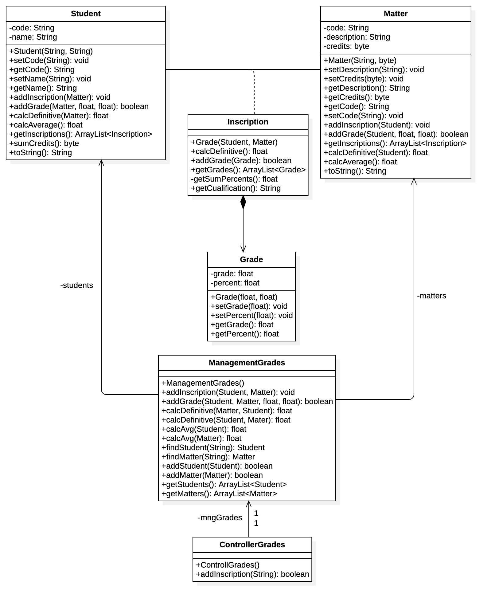

# GESTIÓN DE NOTAS

Proyecto que ilustra las `clases asociación` para resolver cardinalidad de muchos a muchos entre dos clases.

Un Estudiante cursa varias materias, una Materia por su parte es vista por muchos estudiantes. La clase asociación `Inscription` resuelve la cardinalidad de muchos a muchos que se presenta. Además esta clase puede tener sus propios atributos, que en este caso serían las notas respectivas

## Descripción de Clases

### Grade

#### Atributos

Almacena la nota y su porcentaje correspondiente

- _grade_. Especifica la nota
- _percent_. Especifica el porcentaje de la nota

#### Métodos

- _Grade()_. Constructor de la clase, recibe como parámetros los atrubutos de la clase
- _Métodos de Interfaz_. Métodos `get and set` para asignar y conocer los valores de los atributos de la clase.

### Inscription

Clase que mantiene los datos de una inscripción que incluye un Estudiante con una Materia y las notas respectivas

#### Atributos

- _student_. Referencia al estudiante de la inscripción
- _matter_. Referencia a la materia de la inscripción
- _grades_. Colección (ArrayList) de objetos de la clase `Grade`, especifica las notas de una inscripción con los porcentajes de cada una

#### Métodos

- _Grade()_. Constructor de la clase, recibe las referencias del estudiante y materia correspondiente
- _calcDefinitive()_. Calcula la definitiva de las notas de la inscripción, se debe tener en cuenta el porcentaje correspondiente de cada una.
- _addGrade()_. Permite agregar una nueva nota, recibe como argumento o parámetro formal una instancia de la clase `grade`. Valida que los porcentajes de las notas no excedan al 100%
- _getGrades()_. Método que retorna el arreglo o colección de notas
- _getSumPercents()_: Retorna la suma actual de los porcentajes de las notas existentes
- _getCualification()_. Método que con base en la nota definitiva, retorna una cadena de texto con un concepto cualitativo así:
  - Entre 0 y 2 retorna INSUFICIENTE
  - Entre 2.1 y 2.9 retorna NO APROBADO
  - Entre 3.0 y 4.0 retorna APROBADO
  - Entre 4.1 y 5.0 retorna EXCELENTE

### Matter

Clase que encapsula los datos y acciones de los objetos de las materias

#### Atributos

- _description_. Describe la materia
- _credits_. Especifica el número de créditos de la materia
- _inscriptions_. Colección o arreglo que almacena las inscripciones (Estudiantes que cursan la materia)

#### Métodos

- _Matter()_. Constructor de la clase, recibe los valores de los atributos
- _métodos de interfaz_. Permiten asignar y  retornar los valores de los atributos de la clase
- _addInscription()_. Permite agregar un estudiante a la materia a través de una nueva instancia de la clase `Inscription` que se agrega al arreglo correspondiente, recibe una referencia del estudiante.
- _addGrade()_. Método que permite agregar una nota a un estudiante, recibe la referencia del estudiante, la nota y el porcentaje correspondiente. Tiene como precondición que la referencia del estudiante es válida, es decir, existe como objeto en una de las inscripciones.
- _getInscriptions()_. Retorna la colección de Inscripciones que tiene la materia
- _calcAverage()_. Método que calcula el promedio de notas de la materia, con base en las definitivas de los estudiantes.

### Student

Clase que encapsula los datos y acciones de los objetos de los estudiantes

#### Atributos

- _code_. Describe el código del estudiante
- _name_. Especifica el nombre del estudiante
- _inscriptions_. Colección o arreglo que almacena las inscripciones (Mateias que ve o cursa el Estudiante)

#### Métodos

- _Student()_. Constructor de la clase, recibe los valores de los atributos de la clase, inicializa el arreglo
- _métodos de interfaz_. Permiten asignar y  retornar los valores de los atributos de la clase
- _addInscription()_. Permite agregar una materia al estudiante través de una nueva instancia de la clase `Inscription` que se agrega al arreglo correspondiente, recibe una referencia de la materia.
- _addGrade()_. Método que permite agregar una nota a una materia, recibe la referencia de la materia, la nota y el porcentaje correspondiente. Tiene como precondición que la referencia de la materia es válida, es decir, existe como objeto en una de las inscripciones.
- _calcDefinitive()_. Calcula la definitiva para una materia que se recibe como argumento o parámetro formal.
- _getInscriptions()_. Retorna la colección de Inscripciones que tiene el estudiante
- _calcAverage()_. Método que calcula el promedio de notas con base en las materias que cursa el estudiante
